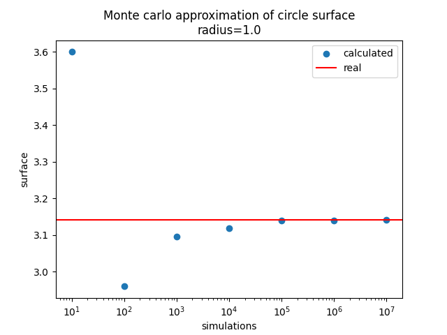

# MONTE CARLO SIMULATION - Surface of a circle calculation

Simple Python script to estimate the surface of a circle with Monte Carlo 
simulation and comparison with the actual analytical calculation of its surface.

How to run the script:

There are 3 arguments and all are optional, 
- RADIUS: radius of circle we are looking to calculate its surface
- SIMULATIONS: number of random points to generate in order to approximate the circle surface. The larger this number, the better the estimation but it comes with a computational cost
- SIMULATION_FLAG: if given True then a figure is generated and saved in the directory with the approximation imrpovement for a range of simulations

`>>>python circle_surface_MC.py" RADIUS SIMULATIONS SIMULATION_FLAG`

Examples:

`>>>python circle_surface_MC.py"` 
**Output**: 

_Monte Carlo estimation of the surface of circle 
radius				=	1 
simulations			=	1000000 
Calculated circle surface value	=	3.144308 
Real circle surface value	=	3.141592653589793 
Similarity level		=	99.91 %_

`>>>python circle_surface_MC.py" 2 15000` 
**Output**: 

_Monte Carlo estimation of the surface of circle 
radius				=	2.0 
simulations			=	15000 
Calculated circle surface value	=	16.0 
Real circle surface value	=	12.566370614359172 
Similarity level		=	72.68 % 

`>>>python circle_surface_MC.py" 1 1000 True` 
**Output**: 

_Monte Carlo estimation of the surface of circle 
radius				=	1.0 
simulations			=	1000 
Calculated circle surface value	=	3.144 
Real circle surface value	=	3.141592653589793 
Similarity level		=	99.92 %_ 
Figure saved in monte_carlo_circle_surface_simulations.png_

x axis: number of simulated points 
y axis: surface (calculated: blue points, real: red line)

-----------------
Idea taken from Ritvikmath Youtube Channel, video = Monte Carlo